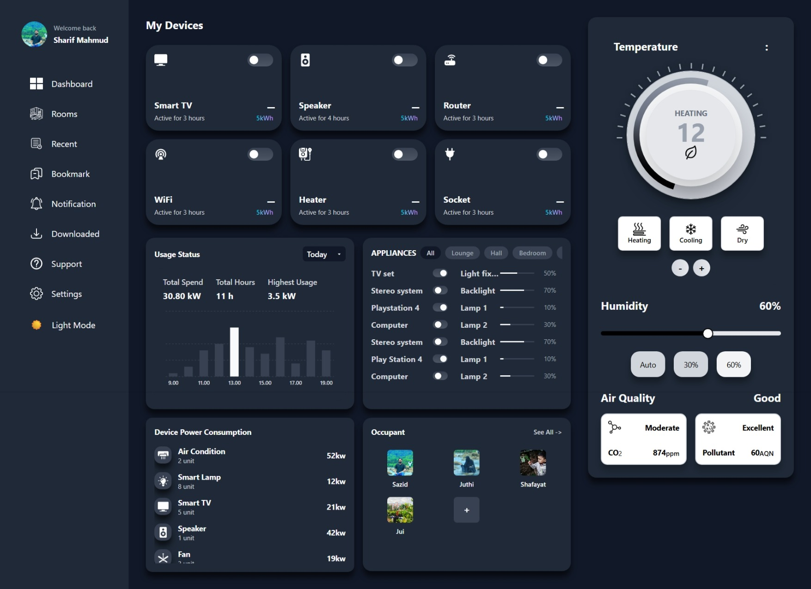

# HomeSync: Smart Home IoT Dashboard

[](https://reactjs.org/)
[](https://nodejs.org/)
[](https://www.postgresql.org/)
[](https://socket.io/)

HomeSync is a comprehensive **Full-Stack IoT Dashboard** designed as a "Digital Twin" for modern smart homes. It features real-time device control, live environmental monitoring, and energy analytics, all backed by a high-performance Node.js backend.

> [!IMPORTANT]
> This project has been upgraded to a **Full-Stack IoT System** with real-time database persistence and hardware simulation.

---

## 📸 Portfolio Showcase



---

## ⚡ Key IoT Features

- **Digital Twin Simulation**: Built-in IoT hardware simulator that mimics real-world power consumption, air quality (CO2/AQN), and temperature fluctuations.
- **Bi-Directional Real-Time Sync**: Utilises **Socket.io** to instantly synchronise device states across multiple clients/tabs without page refreshes.
- **Energy Analytics Engine**: A dedicated analytics pipeline that tracks and visualises power consumption trends over 7, 14, and 30-day periods using **Recharts**.
- **Adaptive Environmental Monitoring**: Real-time tracking of indoor environmental conditions with automated system alerts for critical levels.
- **Secure Authentication & Profiling**: Full JWT-based authentication system with protected routes, persistent user sessions, and customisable user profiles.
- **Occupancy Management**: Intuitive interface to monitor and manage household occupancy states directly from the dashboard.
- **Immersive UX**: A highly polished, responsive interface featuring dynamic scroll-triggered landing page animations and a modern futuristic aesthetic.

---

## 🛠️ The Technical Stack

### **Frontend**
- **React 18 & TypeScript**: For type-safe, component-driven UI development.
- **Tailwind CSS**: Custom dark/light mode theme system with glassmorphism effects.
- **Vite**: High-performance build tool for instant HMR.
- **Framer Motion & Lenis**: For fluid, scroll-triggered animations and buttery smooth continuous scrolling on the marketing landing page.

### **Backend**
- **Node.js & Express**: Scalable REST API architecture.
- **PostgreSQL**: Robust relational data modelling for device history and logs.
- **Socket.io**: Persistent WebSocket connections for low-latency IoT signalling.

### **DevOps & Infrastructure**
- **Docker & Docker Compose**: Containerised architecture for one-command deployment.
- **Nginx**: Production-grade static file serving with SPA routing.
- **CI/CD Ready**: Pre-configured for Netlify (Frontend) and Render (Backend).

---

## 🚀 Getting Started (IoT Mode)

### 1. Environment Configuration
Create a `.env` file in the `server` directory using the provided `.env.example`.

### 2. Using Docker (Recommended)
Launch the entire IoT stack (Frontend, Backend, and Database) with a single command:
```bash
docker-compose up --build
```

### 3. Native Local Setup
**Backend:**
```bash
cd server
npm install
npm run migrate # Setup Database
npm run seed    # Populate Demo IoT Devices
npm run dev
```

**Frontend:**
```bash
cd client
npm install
npm run dev
```

---

## 🚀 Deployment Guide

This application is designed for a split-deployment architecture: **Netlify** for the frontend and **Render** for the backend.

### 🎨 Frontend: Netlify
1. **Connect Repo**: Select your GitHub repository.
2. **Base Directory**: `client`
3. **Build Command**: `npm run build`
4. **Publish Directory**: `dist`
5. **Environment Variables**:
   - `VITE_API_URL`: Your Render service URL **with /api suffix** (e.g., `https://homesync-smart-home-iot-dashboard.onrender.com/api`)

### ⚙️ Backend: Render
1. **Service Type**: Web Service.
2. **Root Directory**: `server`
3. **Build Command**: `npm install && npm run build`
4. **Start Command**: `npm start`
5. **Environment Variables**:
   - `DATABASE_URL`: Your PostgreSQL connection string (Neon.tech recommended).
   - `JWT_SECRET`: A long secure random string.
   - `CLIENT_URL`: Your Netlify site URL (e.g., `https://your-site.netlify.app`).
   - `PORT`: `5000`

---

## 📖 IoT Implementation Details

### The Simulated Environment
To prove production-readiness without physical hardware, HomeSync uses a **Simulation Engine** (`server/src/services/simulator.ts`).
- It calculates power drain based on device type (e.g., an AC consumes 2.5kW, while a Lamp consumes 0.06kW).
- It generates environmental noise to mimic real-world sensor fluctuations.

### Database Architecture
Optimised raw SQL queries handle high-frequency sensor readings, ensuring that the history log remains performant even with thousands of simulated data points.

---

## 👨‍💻 Author
**Sharif Mahmud Sazid**  
*Specialising in Full-Stack Web Development & Real-Time Systems.*

---
*Developed as a high-performance showcase of modern IoT software architecture.*